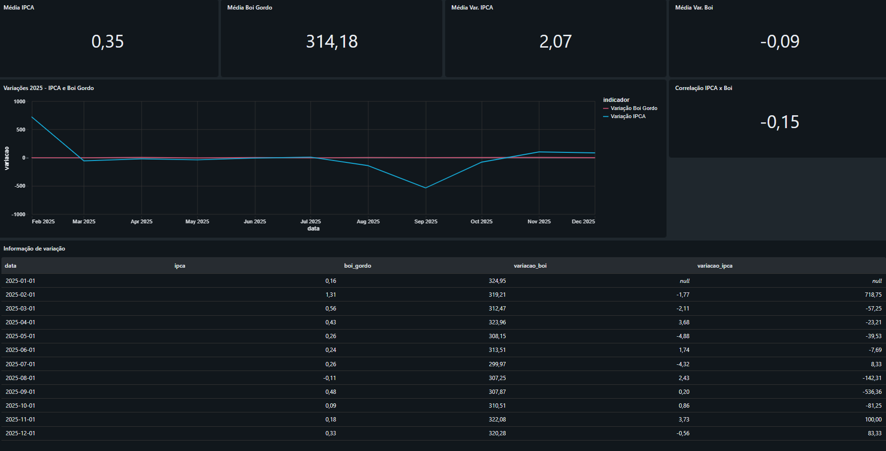
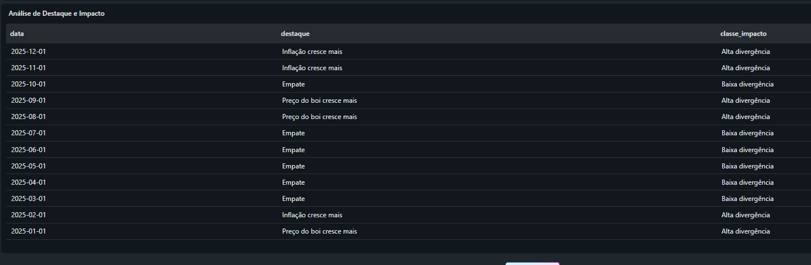

markdown
<h1 align="center">🐂 Pipeline ETL – Medalhão IPCA x Boi Gordo</h1>

 

## 📌 Objetivo

Pipeline de dados em arquitetura medalhão (Bronze, Silver e Gold) que cruza a
variação do IPCA com a variação do preço do boi gordo, gerando insights sobre
como o preço da carne pode impactar a inflação no Brasil.

 

---

 

## 📚 Origem do Projeto

Este projeto teve como base um estudo desenvolvido durante o curso de pós-graduação
em Engenharia de Dados e IA (Anhanguera).

A fonte de dados (API do Banco Central e indicador de excel da CEPEA) e a estrutura de
arquitetura medalhão seguem o que foi ensinado no curso.

### ➕ O que foi desenvolvido por conta própria

- Cálculo de correlação global entre `variacao_ipca` e `variacao_boi` (`corr()`)
- Cálculo de médias globais de IPCA e boi gordo (`AVG()`)
- Classificação de **destaque** e **classe de impacto econômico**, com limiar
  dinâmico calculado pela mediana da distribuição

 

---

 

## 🏗️ Arquitetura

### 🥉 Bronze

- `bronze_economia.ipca`: dados extraídos via API do Banco Central (série 433 – IPCA)
- `bronze_economia.boi_gordo`: dados extraídos indicador excel da CEPEA
- Ambas as tabelas recebem uma coluna `data_coleta` (timestamp da ingestão)

### 🥈 Silver

- Padronização de tipos (datas convertidas para `yyyy-MM`, valores numéricos para `double`)
- Join entre as séries de IPCA e boi gordo por data
- Tabela final: `silver_economia.economia`

### 🥇 Gold

- Cálculo de variação percentual mês a mês (`variacao_ipca`, `variacao_boi`) usando
  `Window` + `F.lag()` no PySpark
- Tabela final: `gold_economia.insights`, exposta pela view `vw_gold_dashboard`
- Classificação de **destaque** (qual variável cresceu mais) e **classe de impacto**
  (alta/baixa divergência), calculada via SQL com limiar dinâmico baseado na mediana
  da distribuição (sem valor fixo arbitrário)

 

---

 

## 📁 Estrutura do Repositório

Arquitetura_medalhao/

├── 0.Config/ → configuração de catálogo e schemas

├── 1.Bronze/ → ingestão do IPCA e do boi gordo

├── 2.Silver/ → tratamento e join das fontes

└── 3.Gold/ → variações, correlação e classificação de impacto

dashboard.png → dashboard (visão geral)

Análise de Destaque e Impacto.png → dashboard (tabela de classificação)

README.md → este arquivo

 

---

 

## 📊 Dashboard

O dashboard foi criado no Databricks (AI/BI Dashboards) e reúne médias globais,
série temporal das variações, correlação global e classificação de destaque/impacto
por período.

> ℹ️ O arquivo do dashboard está salvo neste repositório em formato `.lvdash.json`
> (configuração técnica interna do Databricks). Esse formato não é visual — por isso
> os prints abaixo mostram o resultado renderizado.

**Visão geral: médias, variações mensais e correlação**

**Análise de destaque e classe de impacto por período**

 

---

 

## 🛠️ Tecnologias

`Databricks` `PySpark` `Delta Lake` `SQL` `API do Banco Central` `Web Scraping (CEPEA)`
